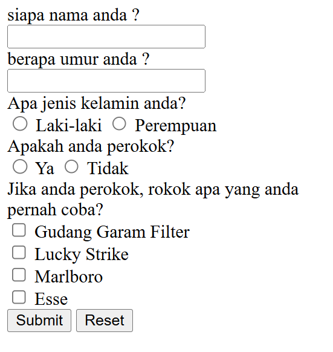

# Survey Perokok

Form HTML sederhana untuk survei perokok.

## Isi Form

- Nama
- Umur
- Jenis kelamin (Laki-laki / Perempuan)
- Apakah perokok (Ya / Tidak)
- Pilihan rokok yang pernah dicoba

## Cara Menjalankan

1. Buka file `index.html` di browser.
2. Isi form sesuai pertanyaan.
3. Klik **Submit** untuk mengirim atau **Reset** untuk menghapus isian.

